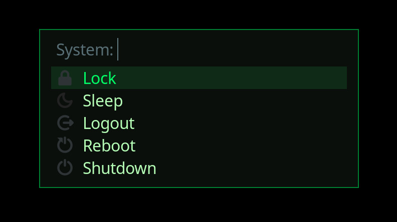

# power-menu

Tiny Hyprland power menu using `fuzzel`.

<p align="center">
    
</p>

## Requirements

- Python 3.12+
- `fuzzel`
- `systemctl` (systemd/logind) for suspend/reboot/poweroff
- `hyprctl` for logout (Hyprland)
- Optional: `hyprlock` for the Lock action

## Usage

Run it directly:

```bash
./main.py
```

Or bind it in Hyprland (example):

```hyprlang
bind = Super, BackSpace, exec, /path/to/power_menu/main.py
```

## Customize

Edit the `actions` list in `main.py` to add/remove entries or change the commands/icons.
