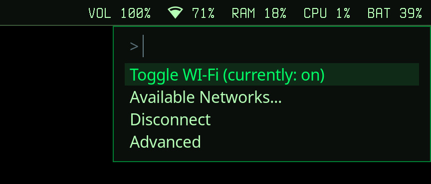

# wifi_menu

Small Wi‑Fi menu for Wayland that uses `fuzzel` for the UI and `nmcli` (NetworkManager) for Wi‑Fi control.

<p align="center">
    
</p>

## Requirements

- Python 3.12+
- `nmcli` (NetworkManager)
- `fuzzel` (Wayland launcher)

## Run

From the repo root (uninstalled):

```bash
PYTHONPATH=src uv run python -m wifi_menu
```

After installing:

```bash
uv tool install .
wifi_menu
```

## Notes

- The menu supports toggling Wi‑Fi, listing networks, connecting (with password prompt), and disconnecting.
- Network changes may require appropriate permissions/polkit rules depending on your system configuration.
- Currently network passwords appear in system's `ps` due to the way program uses nmcli to connect, will turn to using tempfiles in future updates.
